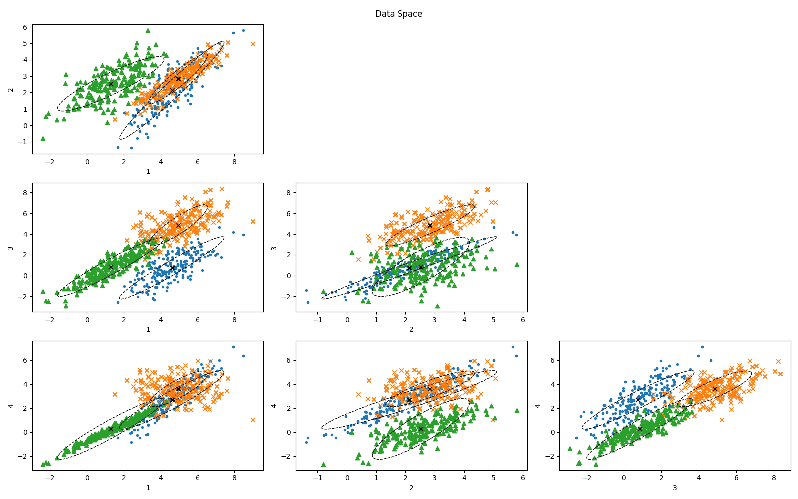
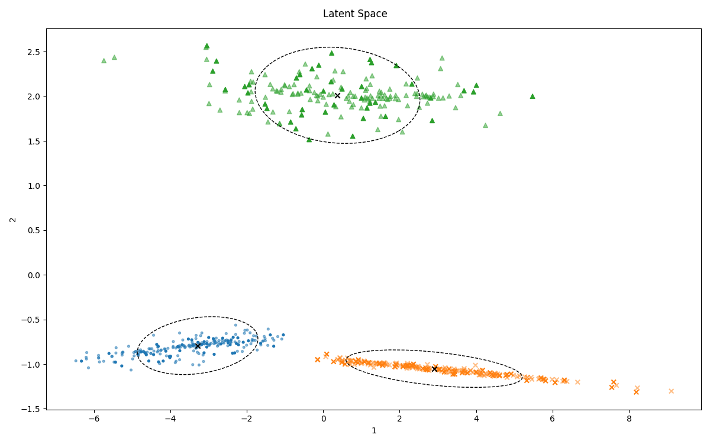

 

  

[Examples](#examples) -[Install](#install) - [Documentation](#documentation)

This `python` package implements the Mixtures of Common Factor Analyzers model
introduced by [Baek+ 2010](https://ieeexplore.ieee.org/document/5184847). It uses [tensorflow](https://www.tensorflow.org/) to implement the stochastic
gradient descent, which allows for model training without prior imputation of
missing data. The interface resembles the [sklearn](https://scikit-learn.org/stable/) model API.

# Examples

The examples below illustrate how the clustering performs on simulated data,
first in the complete case and afterwards with missing data introduced. Model selection
and training are shown as well. For the simulated data, we draw 200 points from
three 4D-Gaussian distributions each.

The code to reproduce the examples is in the `mcfa/examples.py` file. The figures can be plotted for any trained `mcfa.MCFA` instance, see [4.5](#org824cd24).

## 4D-Gaussian distribution in 3D-latent space

The 600 4D observations are clustered in 3D-space (`n_factors=3`) using 3 components (`n_components=3`).

Shown below are the data in the original data space and the reduced latent
space, colour-coded by the assigned clusters. The plot is created using the
`mcfa.MCFA.plot_data_space()` class method.

The latent space visualization includes the latent loadings in the upper right
plot if the number of latent factors is larger than 2. The plot is created using
the `mcfa.MCFA.plot_latent_space()` class method.

The training- and validation set losses over the training epochs can be plotted using the `mcfa.MCFA.plot_loss()` class method.

## 4D-Gaussian distribution in 2D-latent space

The example from above is repeated using two rather than three latent factors (`n_factors=3`).

## Model selection for 4D-Gaussian distributions

To select the best suited number of latent factors `n_factors` and number of
components `n_components` for the model, both the Bayesian Information Criterion
(BIC) and the Integrated Completed Likelihood (ICL) are implemented. The ICL is
equivalent to the BIC minus a penalty on the cluster confusion (i.e. the entropy
of the responsibility matrix $\tau$). It therefore suggests an equal or smaller
number of components than the BIC.

## 4D-Gaussian distribution in 2D-latent space with missing data

This example uses the same data as above, except that 30% of all observed
values are randomly removed. The model is trained in two latent dimensions
(`n_factors=2`) with three components (`n_components=3`). Afterwards, the missing
data is imputed using the derived cluster properties and cluster associations (`mcfa.MCFA.impute()`). Data points with imputed features are drawn with 50% opacity below.

# Install

To add the package to your `python` environment, clone the repository and run

    $ pip install --editable .

in the top-level directory.

# Documentation

The MCFA is executed in three steps: initializing the model, training the parameters, and clustering the observations.

The only necessary import is

    from mcfa import MCFA

## Instantiation

The model&rsquo;s main parameters are the number of components (`n_components`) and the number of latent factors (`n_factors`). They are set at when the model is instantiated.

    model = MCFA(n_components=2, n_factors=3)

## Training

Besides the observed data `Y`, there are a handful of parameters which affect the model training.

    model.fit(
        Y, n_epochs, learning_rate=3e-4, batch_size=32, frac_validation=0.1, converge_epochs=10
    )

### Training speed

The number of times that the model is trained on the dataset is set by `n_epochs`.
The `learning_rate` parameter set the learning rate of the Adam optimizer used for
the SGD. Its default value is [3e-4](https://twitter.com/karpathy/status/801621764144971776?lang=en). The `batch_size` parameter is passed to the
`tensorflow.data.Dataset.batch()` method and defines the size of the batches that
the observations are grouped in. Default is `32`.

### Convergence of Loss function

The negative log-likelihood of the model is used as loss function. The
`frac_validation` parameter (default is `0.1`) defines the fraction of data
samples that is used as validation set.  The validation and training loss are
accessible via the `model.loss_validation` and `model.loss_training` attributes
after training, and can be plotted using the `model.plot_loss()` method.

A simple loss function convergence criterion is implemented: If the loss value
averaged over the past `converge_epochs` epochs  (default is `10`) is larger than
the loss averaged over the equal number of epochs before that, the training is
considered to have converged. It may not be reliable and you should always look
at the loss function after training.

### Parameter Initialization

The trainable model parameters are initialized using Principal Components Analysis of the complete-case data followed by clustering with Gaussian Mixture Models.

Note that this requires to have complete observations in the dataset. If this is not the case, consider adding `statsmodels.multivariate.PCA` as initialization method, which supports Probabilistic PCA with missing data.

### GPU vs CPU

If a GPU is available, `tensorflow` will automatically execute the model training
on it. To disable this behaviour, add

    import os
    os.environ["CUDA_VISIBLE_DEVICES"] = "-1"

before the `tensorflow` import.

## Clustering

After training the model, any observations with the same features can be clustered via

    model.transform(Y)  # if no data is passed, the training data is used

Note that `Y` does not necessarily have to be the same data that the model was trained on. The data may contain missing features.

After the `transform()` method, the assigned clusters are accessible via the `model.clusters` attribute. The entire responsibility matrix `tau` is available via the `model.tau` attribute.

## Optional: Imputation

The clustered data may be imputed by running

    model.impute()

The imputed dataset is available via the `model.Y_imp` attribute.

## Optional: Plot the results

The following simple plotting methods are implemented to inspect the trained model parameters:

    model.plot_data_space()       # plot the data in the original space, coloured by the assigned
                                  # cluster and superimposing the cluster ellipses
    model.plot_latent_space()     # plot the data in the latent space, coloured by the assigned
                                  # cluster and superimposing the cluster ellipses
    model.plot_latent_loadings()  # plot the latent loadings
    model.plot_loss()             # plot the loss of the training and validation set

The implementations are quite simple and adapted to the example data. They might
have to be adapted for other data cases.

# Limitations

-   The model parameter initialization is done via principal components analysis. As such, the input data has to contain at least some complete rows.

-   The value `0` is used as a marker for missing values in this implementation. If the observed features of an observation are all equal to zero, it is dropped. `0` has been chosen as it is simplifies the code.

# Other Implementations of MCFA

-   [EMMIXmfa](https://github.com/suren-rathnayake/EMMIXmfa) in `R`
-   [Casey+ 2019](https://github.com/andycasey/mcfa) in `python`. The difference to this implementation is the use of
    the EM-algorithm instead of the stochastic gradient descent in this
    implementation. This requires the imputation of the missing values **before** the
    model training. On the other hand, our implementation does not offer
    as many initialization routines for the lower space loadings and factors.

